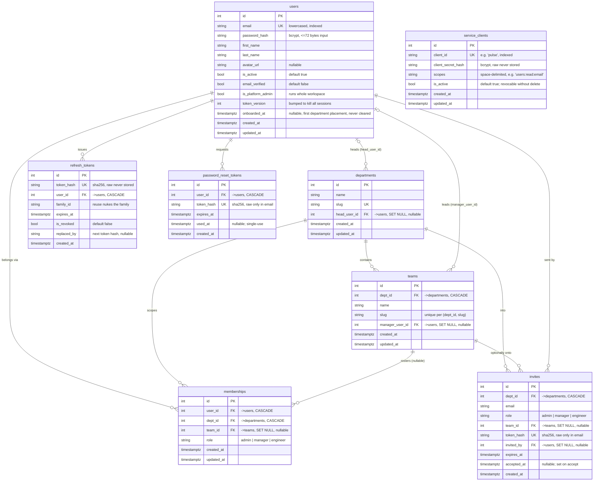
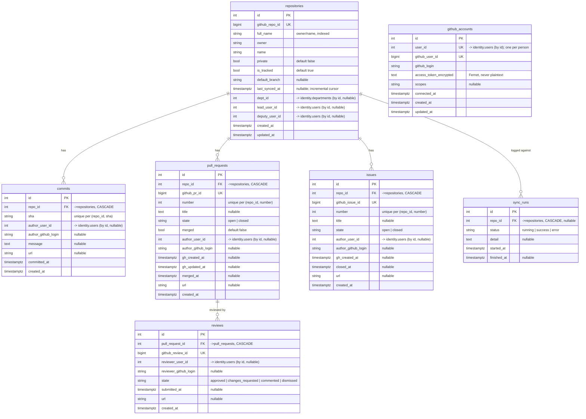
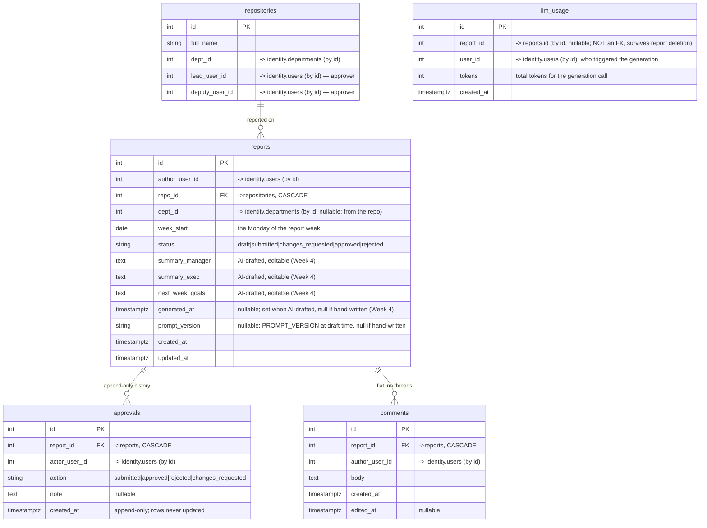
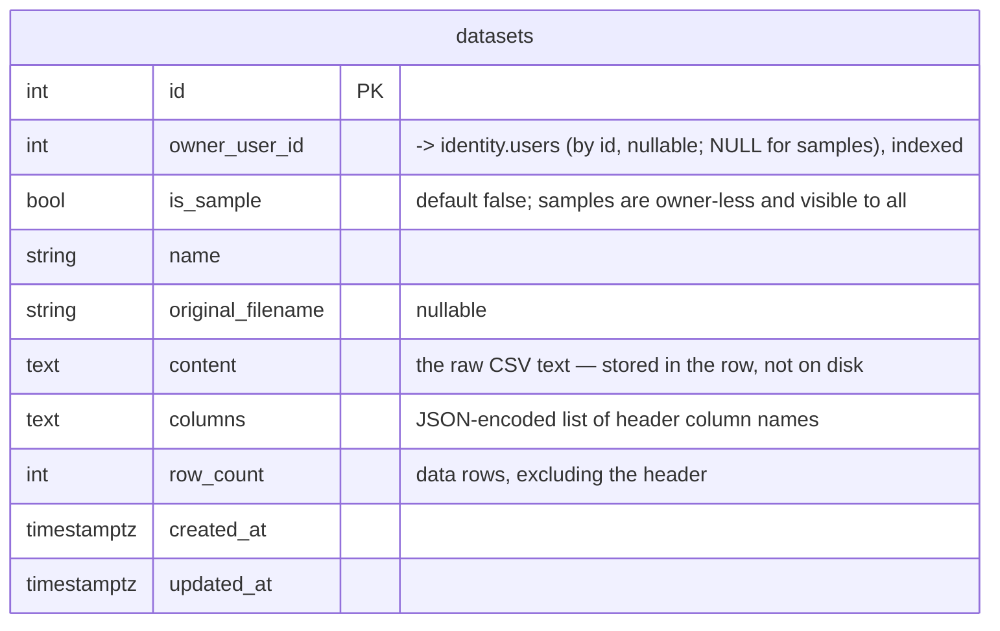

# Entity-Relationship Diagram

**Scope:** the platform's database design, kept current with the code.

Three databases, because of the core rule *"products own their own data and
reference identity by id"* (see `CLAUDE.md`):

1. **Identity DB** — `services/identity`. **Built & migrated `0001`–`0010`.**
   People, departments, teams, memberships, sessions, invites, password resets,
   and (migration `0008`) **service clients** for service-to-service auth.
2. **Pulse DB** — `services/pulse`. **Built & migrated `0001`–`0006`.** Two
   domains: the **reporting** domain (reports, approvals, comments, plus the
   Week-4 `llm_usage` ledger) and the **GitHub sync** domain (connected accounts,
   repos, commits, PRs, reviews, issues, sync runs). Reporting is **repo-centric**
   (session 05): a report is about a repo, and each repo has a department, a lead,
   and a deputy. Week 4 (session 06) adds AI-drafted summaries — `reports` gains
   `generated_at` — and a token-usage ledger (`llm_usage`). Since then, `0005`
   dropped `commits.additions`/`deletions` (declared but never populated: GitHub's
   commit-list endpoint doesn't return line counts) and `0006` added
   `reports.prompt_version`.
3. **Forge DB** — `services/forge`. **Built & migrated `0001`–`0002`.** Product 2
   (no-code ML). One table so far: **datasets** (uploaded + bundled sample CSVs),
   with the CSV content stored in the row.

> **Cross-service references are by id, not foreign keys.** Pulse stores
> `author_user_id`, `dept_id`, `lead_user_id`, etc. as plain integers pointing at
> rows in the identity DB. **No database-level FK crosses the service boundary** —
> the two services have separate databases and deploy independently. Below, real
> (enforced) FKs are drawn as relationships; cross-service links are only noted in
> the column comments as "→ identity.X (by id)".

---

## Identity database

> **`service_clients` is standalone** (no relationship to `users`). It's a
> non-human caller — another service (Pulse) authenticating as itself via OAuth2
> client-credentials to mint a scoped service token. The `pulse` row is seeded on
> startup from `PULSE_CLIENT_SECRET`. Migration `0008`.

> **Teams are parked.** The boss's session-05 call is repos, not teams. The team
> model above is still built and tested but no longer drives Pulse reporting; it's
> retained, not deleted (see the "how to delete teams" runbook in
> `docs/decisions/2026-07-30-repo-centric-reporting.md`).

---

## Pulse database — GitHub sync domain

---

## Pulse database — reporting domain

**How reporting works (session-05 decisions):**

- A report is about a **repo**: **one report per (author, repo, week)** — the
  unique key `(author_user_id, repo_id, week_start)`. Working in two repos in a
  week means two reports.
- A repo belongs to a **department** and has a **lead + deputy**, both referenced
  by identity user id. **Both approve** its reports (co-approvers); a department
  admin or platform admin may also approve (override).
- **Read:** author → own · lead/deputy → their repo · department admin → the
  department · platform admin → all.
- Assigning a repo's dept/lead/deputy is done by a department admin (of that dept)
  or a platform admin; **lead ≠ deputy**. A repo with no lead/deputy yet still
  accepts reports (they wait in `submitted`).

---

## Forge database

Product 2 (no-code ML). One table so far. People are referenced by identity
`user_id` only — **no FK crosses into identity**.

> **`uq_sample_name` — partial unique index** on `name` WHERE `is_sample`
> (migration `0002`). Stops two workers booting at once from double-seeding a
> bundled sample; user uploads are excluded by the predicate, so duplicate private
> dataset names stay allowed. A caller sees their own datasets plus every sample and
> nothing else (enforced in `app/services/datasets.py`, not the schema).

---

## Constraints that matter (enforced)

**Identity:** `users.email` · `departments.slug` · `refresh_tokens.token_hash` ·
`invites.token_hash` · `password_reset_tokens.token_hash` · `service_clients.client_id`
all unique. `memberships (user_id, dept_id)` unique. `teams (dept_id, slug)` unique.
`manager_user_id` / `head_user_id` have no uniqueness (one person may lead many).

**Forge:** `datasets` has the **partial** unique index `uq_sample_name` (`name`
WHERE `is_sample`) — sample names are unique; user-upload names are not constrained.

**Pulse:** `repositories.github_repo_id`, `pull_requests.github_pr_id`,
`reviews.github_review_id`, `issues.github_issue_id`,
`github_accounts.user_id`, `github_accounts.github_user_id` all unique.
`commits (repo_id, sha)`, `pull_requests (repo_id, number)`,
`issues (repo_id, number)`, and `reports (author_user_id, repo_id, week_start)`
unique. `lead_user_id` / `deputy_user_id` have no uniqueness (one person may
lead/deputise many repos).

---

## Design decisions behind this schema

- Identity structure (departments, teams, roles, platform admins, one-team-per-
  person): `docs/decisions/2026-07-23-identity-structure.md`.
- Repo-centric reporting (repos replace teams; lead + deputy both approve):
  `docs/decisions/2026-07-30-repo-centric-reporting.md` — **supersedes** the
  team-based approval flow.
