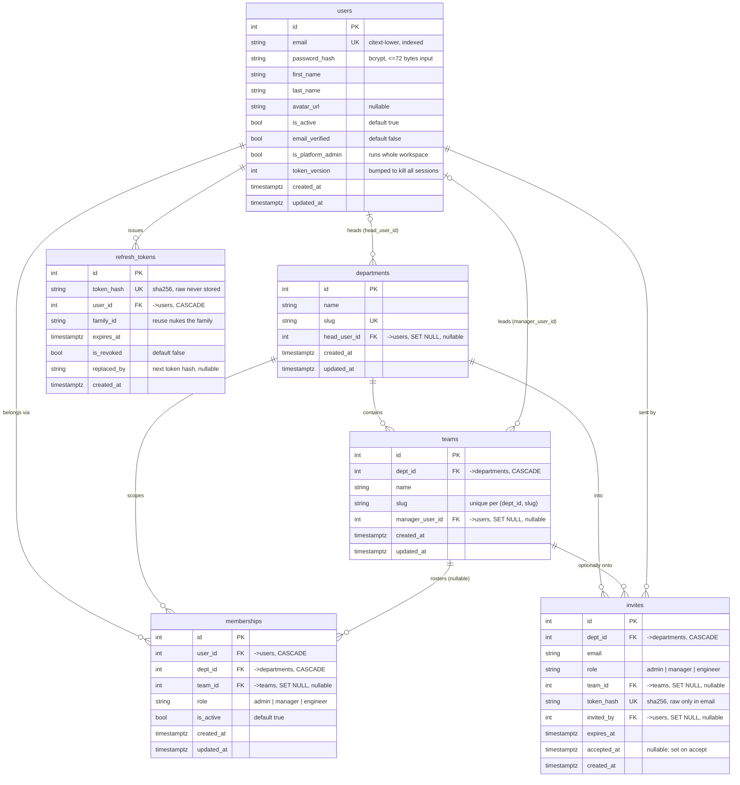
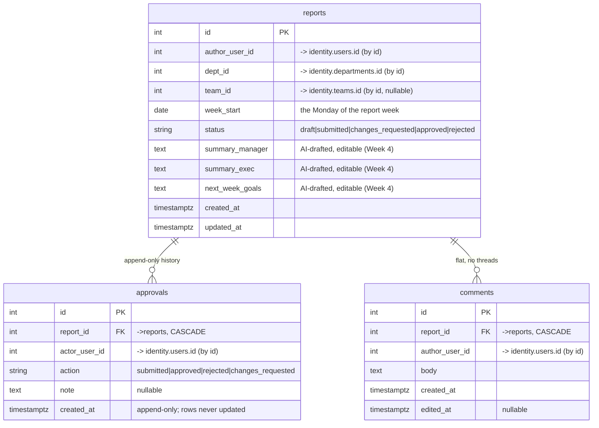

# Entity-Relationship Diagram

**Scope:** the Week 2 "reviewed database design" deliverable.

This covers two databases, because of the platform's core rule *"products own
their own data and reference identity by id"* (see `CLAUDE.md`):

1. **Identity DB** — `services/identity`. **Built and migrated** (`0001`–`0006`).
   Source of truth for people, departments, teams, memberships, sessions, invites.
2. **Pulse DB** — `services/pulse`. **Built and migrated** (`0001`). Reports,
   approvals, comments. Follows the design agreed in
   `docs/decisions/2026-07-23-identity-structure.md` and `docs/backlog.md`:
   weekly report per engineer · approvals as an append-only history · flat
   comments.

> **Cross-service references are by id, not foreign keys.** Pulse stores
> `author_user_id`, `team_id`, `dept_id` as plain integers pointing at rows in
> the identity DB. No database-level FK crosses the service boundary (the two
> services have separate databases and deploy independently). Those logical
> links are drawn as dashed lines; real, enforced FKs are solid.

---

## Identity database — BUILT

**Constraints that matter (already enforced):**

- `users.email` unique · `departments.slug` unique · `refresh_tokens.token_hash`
  unique · `invites.token_hash` unique.
- `memberships (user_id, dept_id)` unique — *one membership per person per
  department* (Decision 3).
- `teams (dept_id, slug)` unique — team slugs are unique within a department, not
  globally.
- `manager_user_id` / `head_user_id` have **no** uniqueness constraint on
  purpose: one person can lead several teams (Decision 3, contingency).

---

## Pulse database — BUILT (references identity by id, no cross-DB FKs)

**Design intent (for review):**

- **One report per engineer per week** → a unique constraint on
  `reports (author_user_id, week_start)`.
- **Who approves** is the engineer's team lead — `identity.teams.manager_user_id`
  for `reports.team_id`. Identity already guarantees exactly one such person
  (Decision 3), so there is no tie to break.
- **`approvals` is append-only**: submit / approve / reject / request-changes are
  each a new row, so the full history survives. `reports.status` is the
  denormalised "current state" for fast listing.
- **`comments` are flat** (no `parent_id`) — a deliberate v1 simplification.
- **No cross-DB FK** from `author_user_id` / `team_id` / `dept_id` into identity:
  Pulse trusts the ids carried in the verified access token and reads names from
  identity's API when it needs to display them.

---

## Design questions this ERD depended on — now settled (session 04)

See `docs/decisions/2026-07-23-identity-structure.md`, Decision 6.

1. **One team per person** — ✅ **confirmed true** at CypherCrescent, so
   `memberships.team_id` stays a single column and every report has exactly one
   team and one approving lead.
2. **Who reads / who approves** — ✅ **decided.** Approval is the report's **team
   lead only** (`identity.teams.manager_user_id`). Read access widens by role:
   engineer → own; team lead → their team; department `manager` role → all
   reports in the department (read-only); admin/head → all; platform admin →
   everything. Enforced in Pulse from the token claims.
3. **Deputies / leave cover** — ✅ **deferred with a fallback.** No deputy field
   for now; when a lead is away a **department admin** approves. Revisit before
   the Week 4 approval flow only if cover turns out to be routine.
